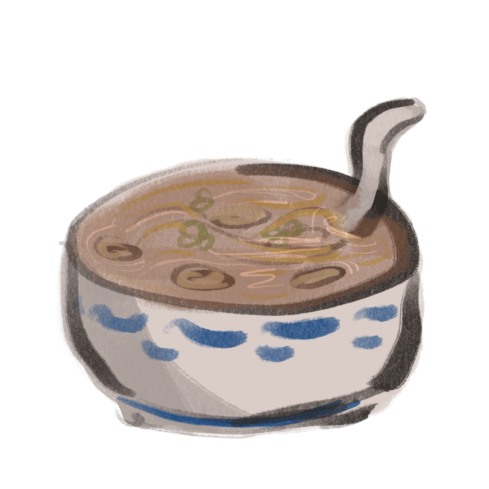
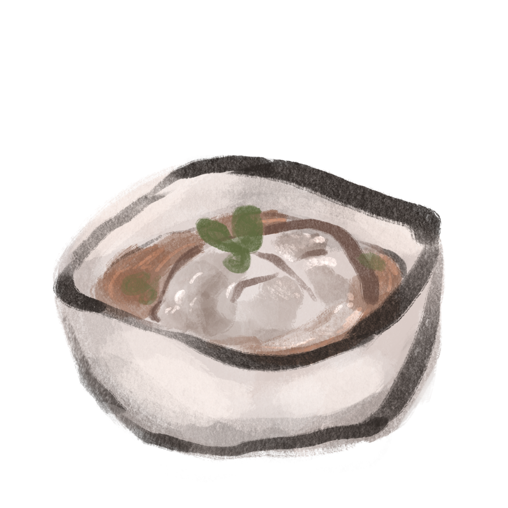
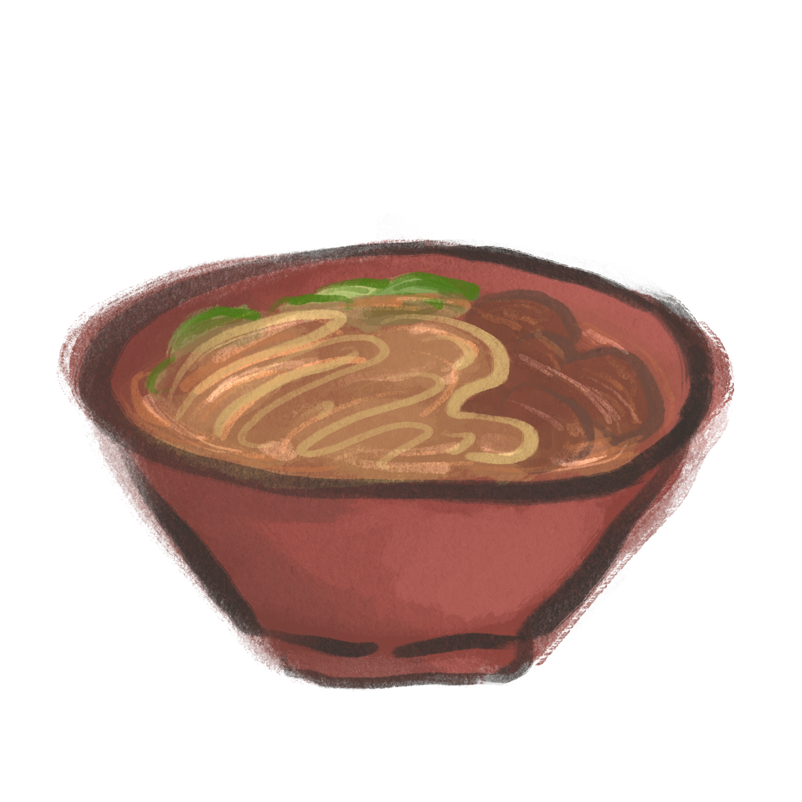

# Top 5 Staple Taiwanese Foods

## *by Jill Yeh*

***

## Table of Contents

>  1. <a href="#Large Intestine Vermicelli">Large Intestine Vermicelli</a>
>  2. <a href="#Taiwanese Meatball">Taiwanese Meatball</a>
>  3. <a href="#Beef Noodle Soup">Beef Noodle Soup</a>
>  4. <a href="#Braised Pork Rice">Braised Pork Rice</a>
>  5. <a href="#Qie Zai Noodles">Qie Zai Noodles</a>

***

 <h2> <a id="Large Intestine Vermicelli"> Large Intestine Vermicelli </a> </h2>
  
 
  
  Out of all the best Taiwanese dishes, Large Intestine Vermicelli takes the number one spot for me. Though it may taste or feel off if you eat a bowl that isn't good, a well-made one is always the most comforting. The more popular version is Oyster Vermicelli, but as a disliker of most seafoods, I'd say the Large Intestine version is much tastier.
  
  [Recipe for Large Instestine Vermicelli](http://www.eatinginabox.com/2015/03/da-chang-mian-xian-streetfood-challenge.html)
  

 <h2> <a id="Taiwanese Meatball"> Taiwanese Meatball </a> </h2>

   

   The Taiwanese Meatball, or Bawan, is made up of meat and a few other flavorful ingredients bundled in a translucent, glutinous skin. But the real star of the show is the sauce, which is salty, a little sweet, and usually a bit spicy. I, for one, *love* eating anything chewy and glutinous, and biting through a Bawan gives you a mouth full of textures and flavors.

[Recipe for Taiwanese Meatballs](https://pengskitchen.blogspot.com/2014/08/taiwanese-meatballs-bawan.html)

 <h2> <a id="Beef Noodle Soup"> Beef Noodle Soup </a> </h2>

   

 <h2> <a id="Braised Pork Rice"> Braised Pork Rice </a> </h2>

 <h2> <a id="Qie Zai Noodles"> Qie Zai Noodles </a> </h2>
